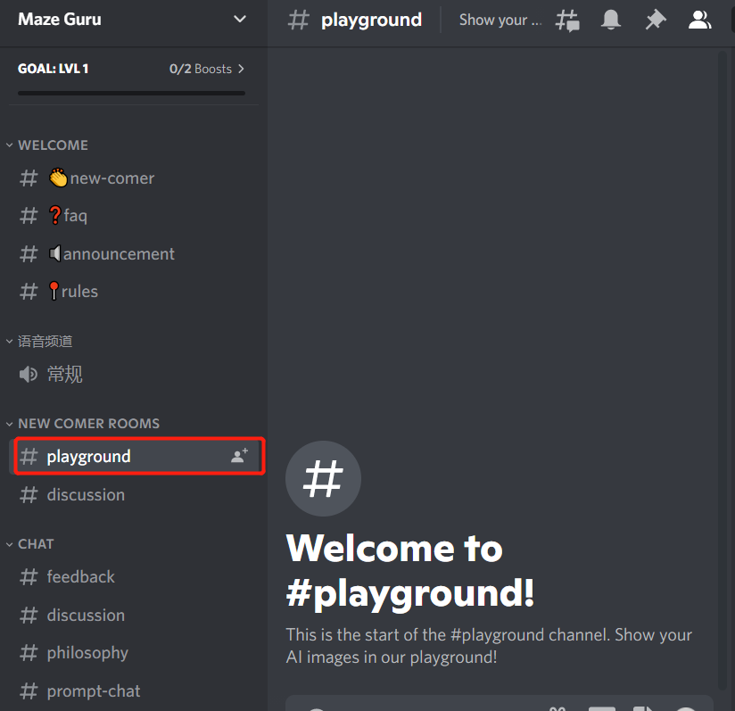
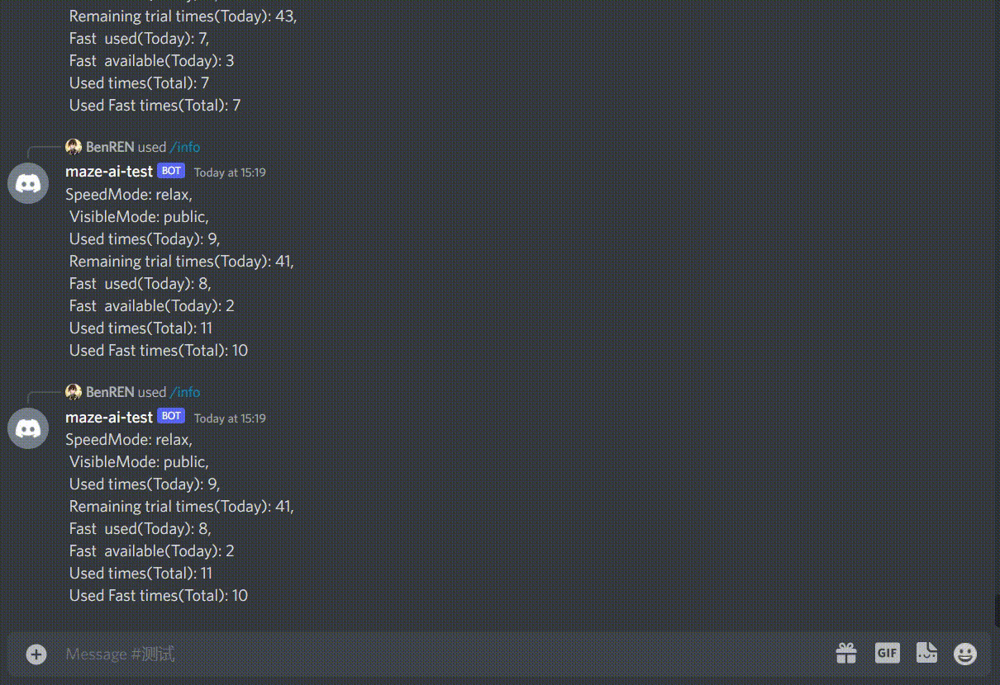
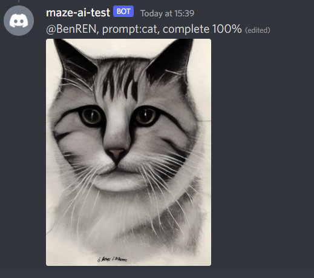

## Quick Start

### What is Maze AI？

Maze AI is a platform that expanding the imaginative powers of the human, exploring new worlds and more possibilities

you can experience all the functions by the Maze Discord bot, join our Discord server :https://discord.gg/JnH9mwvf.

### Create your first AIGC image

Once you start using our service, you will be able to create a limited number of images before needing to subscribe.You will have 50 free uses per day. if you need more you can buy our services

#### 1. Join Maze Discord server

you need to register Discord, login Discord ,and join Maze Server:https://discord.gg/JnH9mwvf.

#### 2.Go to the 'playground' channel

select the NEW COMER ROOM, and go to the 'playground' channel

#### 3.Use the `/image` command

Start typing `/image` and you will notice something pop up above your text.

Click or tap on the `/imagine` option: the prompt field will be created and now you can add whatever you want the bot to generate, as you can see in the video below.

#### 4.Waiting for the image to be generated

wait until the progress to 100%

if you are in `/fast` mode, it take about 1 minute.
if you are in `/relax`, it will in queue and the time is uncertain

#### 5.Save your image

Right click the picture and Save your image

